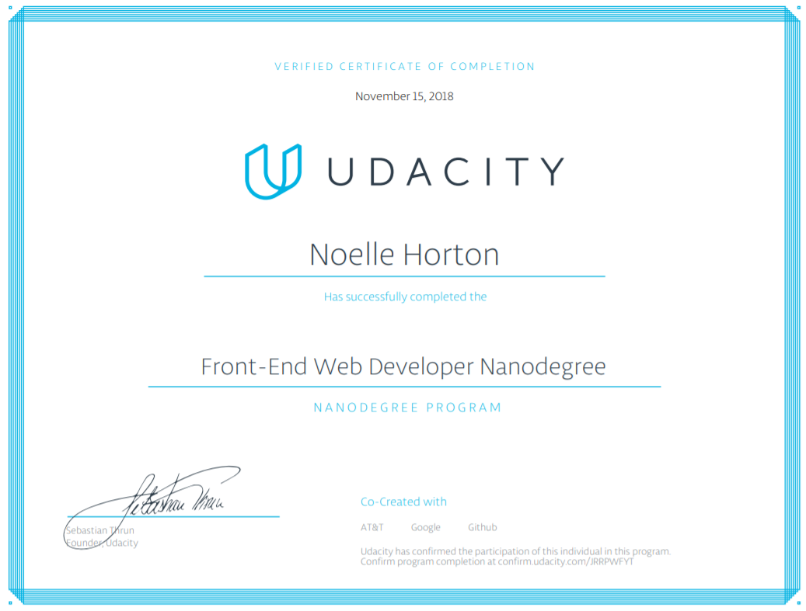

# Udacity FEND Projects 2018
### Table of Contents  
[Projects in This Repo](#projects)

[What is the Udacity FEND Program?](#fend)

[Grow with Google Scholarship](#gwg)

[My Certificate of Completion](#cert)  
***
<a name="projects"/>

## Projects
  1. Portfolio Site 
     - [Rubric](https://review.udacity.com/#!/rubrics/45/view)
  2. Memory Game 
     - [Rubric](https://review.udacity.com/#!/rubrics/591/view)
  3. Classic Arcade Game 
     - [Rubric](https://review.udacity.com/#!/rubrics/15/view)
  4. Feed Reader Testing 
     - [Rubric](https://review.udacity.com/#!/rubrics/18/view)
  5. Restaurant Reviews App 
     - [Rubric](https://review.udacity.com/#!/rubrics/1090/view)
  6. MyReads: Book Tracking App 
     - [Rubric](https://review.udacity.com/#!/rubrics/918/view)
  7. Neighborhood Map 
     - [Rubric](https://review.udacity.com/#!/rubrics/1351/view)
***

<a name="fend"/>

## Udacity FEND Program
The Udacity Front-End Web Development Nanodegree (FEND) program consists of five projects which build mastery of in-demand skills such as:
* HTML5
* CSS3
  * Grid, Flexbox
* Responsive Design
  * Bootstrap
* JavaScript
  * ES6, jQuery, React
* Tools & Testing
  * Gulp, Grunt, Jasmine
* Asynchronous Web Applications
  * AJAX, service workers
* DOM Manipulation
* Web Accessibility
* Object Oriented Programming
* Version Control
  * Git

[View the syllabus for the FEND program here!](https://www.udacity.com/course/front-end-web-developer-nanodegree--nd001 "Udacity FEND Syllabus")
***

<a name="cert"/>

## Certificate of Completion

[View my certificate of completion here!](https://confirm.udacity.com/JRRPWFYT "Noelle Horton FEND Nanodegree")
***

<a name="gwg"/>

## Grow with Google 
The [Udacity Grow with Google web developer program](https://www.udacity.com/grow-with-google "Udacity Grow with Google") grants 1,500 full scholarships to the Udacity Front-End Web Developer Nanodegree program. This challenge scholarship is part of the [Grow with Google iniative](https://grow.google/?utm_source=udacity.com&utm_medium=footer_logo&utm_campaign=udacity.com/grow-with-google "Grow with Google campaign").

As one of the top students in Udacity's Web Development learning track, I achieved the Grow with Google scholarship and completed my Front-End Web Development nanodegree in November of 2018.